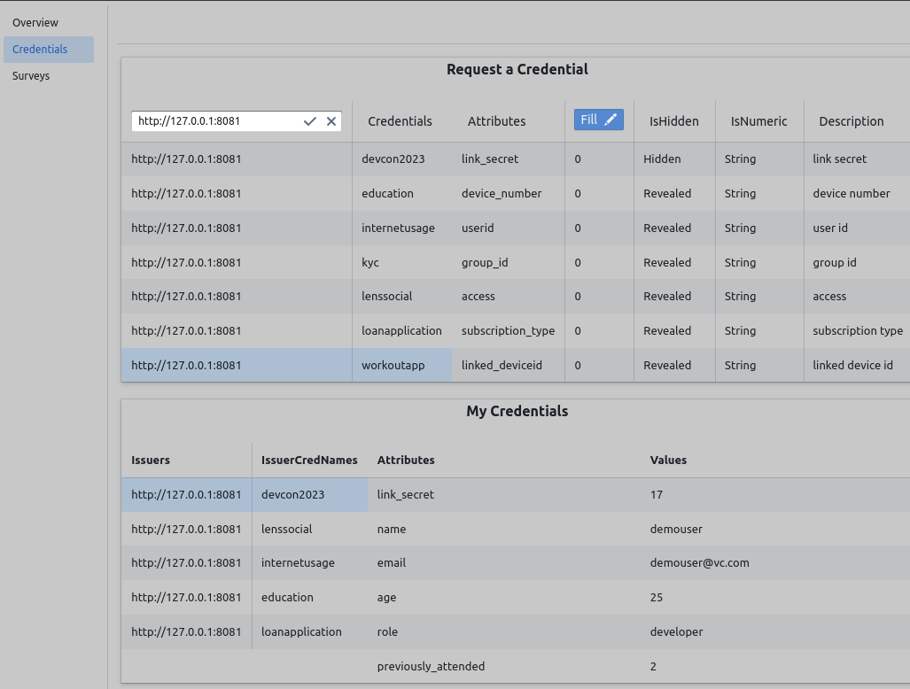

## Background

Verifiable Credentials are cryptographic proofs of user data issued by some responsible authority. They can be presented to any party who can verify the validity of this credential and attributes in it. A frequent example is that of a birth certificate, issued by some government authority, which can be submitted to a liquor store such that only the age or proof of it meeting the age threshold is submitted to the store owner; it could be gym and store memberships, ticketing systems or a KYC credential sought by some decentralized application. These seemingly simple and overused examples do a good job at introducing verifiable credential but shy away from painting a larger picture where it is only but a small part. 

For example, the store membership you use will get you to buy from the same place again for discounts, possibility for rewards, suggest products you are likely to buy; it could also be used by the store to run some analytics and figure out how it can optimize its operation. A conference ticket could give you exclusive access to some meetings and presentations and also helps organizers conduct surveys and find you prospects you are likely to have a business relation with. Here we see that, for consumers, credentials are convenient services, while for service providers, they are a list of data points used to help optimze their operation. Now, when we swap in verifiable credentials that are meant to provide a richer set of features to the consumers, will we be taking away some necessary ability from the service providers ? For example, while presenting a verifiable credential, it's possible to mask everything written on it except that the credential is still valid to this date; this reduces the ability to make personalized recommendations and maybe more. Realizing the scope of a verifiable credential integration helps derive requirements that a useful product should fulfill. 

## The Product

Now we introduce a product that serves as a platform to help users discover and realize the value of verifiable credentials. It does so by providing the following set of features.
1. A privacy preserving search-engine where users can discover how they can use their credentials and data requesters can clearly express what they seek from user data.
2. A core set of ready-to-use libraries to help you get started with integrating verifiable credential, whether you're a service provider, a credential holder or a requester of user data.
3. Integration with incentivization tools (and marketplace) to ensure value flows between data owner and the highest bidder.

Instead of delving too much into technology used right away, we'll start with a set of broad usecases that help illustrate the benefits of this product.

### Usecases

1. Ticketing and Targeted Information Distribution
    
    Premise:

    A user is given a credential that serves as a ticket for a conference. In the credential is a "job" attribute with the value "developer". The user has enabled queries from conference organizers to access his credential and raise notifications if these queries match his credential. 
    Now the organizers want to inform developers only that a planned meeting will be potponed to a later time. To do so, the organizer creates a query using the product that targets developers and developers will be notified of the message. 

    Usecase:

    Verifiable credentials have been known to be useful for access and role based access controls. What's different here is an illustration of how the ability to **make targeted queries on verifiable credentials** can help organizers manage the event better. 

2. Privacy Preserving Advertisement and Viewing Incentives

    Premise:

    A social media application (e.g. Lens Protocol) keeps track of how active you've been on the platform and issues a credential each week that includes your activity score. Or, a web browser extension or a system application generates a credential mentioning how much you've been using different types of applications. 
    
    An application, that wants to help detox users from social media, creates a query that checks if "activity" attributes in the user credential is within harmful range. A user's web application will pull the query, run checks privately to see if the query matches his credential and suggest the detox app and its benefits.

    The advertisement publisher has specified that ad viewers will get rewards for it and the user has enabled only those ad queries to be fetched, processed and run which offer high rewards for viewing.

    Usecase:

    This builds on the target query example above but shows a few key features possible only with this product. 
     - Verifiable credentials can be issued by a wider range of sources including device applications, web browsers, social media apps, etc; the libraries we provide help with the integration.
     - By matching query with credentials on the user's device, particularly sensitive user details will not have to be traded for getting the right recommendations. This helps demonstrate the **value of privacy preserving search engine**.
     - To thwart spam attacks where a large number of queries can flood the user's device resources, the user can only fetch, process and view advertisements that have staked rewards for viewing it. This builds **incentive to interact on the platform** and helps move value from the supplier to the highest bidder.

3. Surveys and Aggregate Statistics

    Premise:
    
    An HBR Survey wants to check if minority groups living in a certain location are susceptible to discrimination in salary or loan applications. It creates a query that matches if users are from the target demography and requests the product to provide it an aggregate value of salary or credit worthiness. It can use this aggregate value to compare against the same metric gathered from a different demography. To ensure participation, it has offered certain amount of tokens for willing participants.

    Usecase:

    On top of targeted queries and incentivization mentioned previously, this example focuses on multiple user data points and the ability of the product to **provide aggregate statistics** on it. This way the data requesters can fetch the results they need and the users can participate without having to submit their private data. Providing data point itself instead of the sought computation on it, not just has the potential to violate user privacy in the long run, it also diminishes information asymmetry and the value user gains from it i.e. if all user data has been pulled by some data requester, there will be nothing of value left for the user to sell.

## Market Opportunity

We believe that the product has a few set of merits that unlocks a large and diverse market. Following are the best of them.

1. Find a Large Playground

    Though there has been extensive work on Verifiable Credential, it hasn't picked up to the scale that it should have. We think this is because current works have limited themselves to a small set of high authority issuers and their use cases, while we believe anyone can be an issuer given that the credential issued gains high perceived value. 
    
    This perspective allows diverse groups to engage in verifiable credential ecosystem and complement one another. For example, a decentralized social media that issues a credential containing user's age may have less value (or truth to it) than a credential issued by a government authority containing the user's age. However, it's much better than having nothing and at least serves as an interim credential that can eliminate dependency on high profile issuers, unlocks immediate usecases and might even let the authorized issuer realize the value it missed out on. 

2. Unique and Efficient

    The product binds recent advances in tehnology and standards like zero-knowledge proofs, simple multi party computation, private aggregate statistics, tokenomics, verifiable credential standards to build a useful and efficient product that can run in user's device. It provides features that users have been accustomed to and does so in a privacy preserving and beneficial way. This sets it apart from currently existing products. 

2. Focus on Privacy Enhancing Technology

    There has been growth on privacy enhancing technology and public discourse on it. For example, the gradual discontinuation of third party tokens as a means for personalized ad suggestions, which has been a major source of revenue for big tech shows how powerful the driving force is. When businesses themselves push user privacy even if for marketing edge, the community learns the benefits and paves way for privacy friendly applications to grow.

3. Blockchains and Tokenization

    The product has uses in both web2 and web3 technology. The immutability and incentivization aspects of blockchain is useful to the product and the value of decentralized identity and verifiable credentials is useful to blockchain. This mutual exchange of values makes the product useful in web3 applications.

4. Synergy with Existing Products

    Verifiable Credential mixes in well with **web3 Gaming, NFTs and Defi*. Users holding an NFT can request a token gated issuer to issue it a verifiable credential containing attributes present in the NFTs metadata. The user can then use this cryptographic proof to show that it holds a valid NFT alongside all the benefits of ZK Proof and Verifiable Credential. 

## Roadmap

| Milestone | Dates |
| --------- | ----- |
| Research and develop a working proof of concept | March-June |
| Integrate applications | June+ |

For a more detailed list, see [activity log](https://github.com/manishbista28/articles/blob/main/credentialportal/activity.md).

Github Repository: [Credential Portal](https://github.com/manishbista28/credentialportal)

### Screenshot of PoC application:

Fig 1: Overview page showing queries that a user can interact with

Fig 2: Credential page showing how one can request for a credential